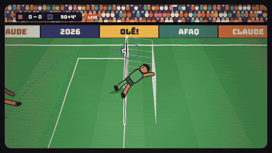

# Claude Animation Studio

**A Claude Code plugin for making animated short films where every frame is drawn in code and the music is synthesized in code, perfectly in sync.**



*From "Claude × Afaq, World Cup 2026", a 58-second film Claude made with this skill. The frames and the soundtrack come from zero samples, stock clips, or music libraries: drums, bass, brass, the crowd, and a street chanting "o-lé".*

## What it does

Ask Claude for a video, and it:

1. writes the story as a **song structure** (intro → tension → silence → drop → outro),
2. puts every moment in one **score file** that both the music and the animation read,
3. **synthesizes the soundtrack** in plain JavaScript: drums, bass, pads, brass, music box, formant-synthesized crowds and choirs, and sound effects,
4. **draws every frame** in a hand-drawn paper-cutout style (boiling pencil lines, hatching, torn-paper captions),
5. renders a 1080p MP4 with headless Chrome + ffmpeg, then **checks its own work** with contact sheets, loudness measurements, and a frame-accurate sync test.

Because one score drives both sides, a football pass can *play* a note of the melody, a title can stamp one letter per 8th note, and fireworks can burst exactly on the clap.

**Your own characters.** People are fully customizable: hair (curly, long, bun, hijab…), beards, glasses, outfits (jersey, hoodie, dress, shalwar kameez…), build and colours. Claude can also build new characters, like pets, robots or mascots, from the same hand-drawn primitives, and drop your real photos into a film as taped prints. Share a photo and say "put me in it".

## Install (Claude Code)

```
/plugin marketplace add i-afaqrashid/claude-animation-studio
/plugin install animation-studio@claude-animation-studio
```

Then just ask, in any project:

> make a 30-second animated video about my cat's birthday, with music

> make an animated short like the Opus animations: Claude helping me study for exams

**Requirements:** Node.js 22+, ffmpeg, and Google Chrome (or Chromium; set `CHROME_PATH` if it's somewhere unusual). No `npm install` needed.

## Using the engine by hand

```bash
node skills/animation-studio/scripts/new-project.js my-film        # starter (23s demo)
cd my-film
node song.js                   # music  -> out/music.wav
node engine/render.js sheet    # preview -> out/sheet.png
node engine/render.js video    # frames  -> out/video.mp4
node engine/render.js mux      # final   -> out/my-film.mp4
```

Add `--from world-cup-2026` to re-render or remix the full 58s reference film instead.

## What's inside

```
skills/animation-studio/
├── SKILL.md              instructions Claude follows
├── references/           storytelling, music cookbook, visual style, engine API, gotchas
├── engine/               synth (DSP, instruments, mixing), drawing toolkit, characters, renderer
├── template/             a 23s starter film
├── examples/world-cup-2026/   the full reference film
└── scripts/new-project.js     scaffolds a new film
```

## Credits

- Inspired by the Claude Opus 5.5 animations people shared on X.
- Fonts: Caveat, Bungee, Patrick Hand, Gochi Hand (SIL OFL 1.1), Permanent Marker (Apache 2.0), all from Google Fonts. License files are in `engine/fonts/`.
- Community project, not affiliated with or endorsed by Anthropic.

MIT License.
